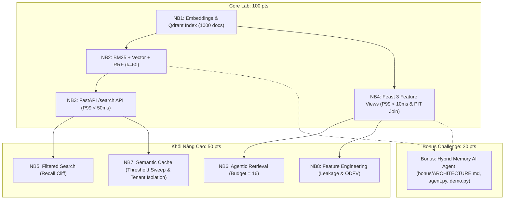

# 🚀 Kế Hoạch Thực Hiện & Bộ Prompt Từng Bước — Lab Day 19 (Track 2)
> **Chủ đề:** Vector Store + Feature Store (Qdrant + BM25 + Hybrid RRF + FastAPI + Feast Feature Store)  
> **Mục tiêu điểm số:** 100/100 Core + 50/50 Advanced (NB5–NB8) + 20/20 Bonus Challenge = **170/170 pts**.

---

## 📑 Mục Lục
1. [Tổng Quan Kiến Trúc & Yêu Cầu](#-tổng-quan-kiến-trúc--yêu-cầu)
2. [Giai Đoạn 0: Setup Môi Trường & Dữ Liệu](#-giai-đoạn-0-setup-môi-trường--dữ-liệu)
3. [Giai Đoạn 1: Core Lab (NB1 – NB4 — 100 Pts)](#-giai-đoạn-1-thực-hiện-core-lab-nb1--nb4--100-pts)
   - [NB1 — Embeddings & Vector Indexing](#-bước-11-nb1--embeddings--vector-indexing)
   - [NB2 — Hybrid Search & RRF Fusion](#-bước-12-nb2--hybrid-search--rrf-fusion)
   - [NB3 — FastAPI Search Service & Latency Benchmark](#-bước-13-nb3--fastapi-search-service--latency-benchmark)
   - [NB4 — Feast Feature Store Pipeline](#-bước-14-nb4--feast-feature-store-pipeline)
4. [Giai Đoạn 2: Khối Nâng Cao (NB5 – NB8 — 50 Pts)](#-giai-đoạn-2-thực-hiện-khối-nâng-cao-nb5--nb8--50-pts)
   - [NB5 — Filtered Search & Recall Cliff](#-bước-21-nb5--filtered-search--recall-cliff)
   - [NB6 — Agentic Retrieval as a Tool](#-bước-22-nb6--agentic-retrieval-as-a-tool)
   - [NB7 — Semantic Cache & Multi-Tenant Isolation](#-bước-23-nb7--semantic-cache--multi-tenant-isolation)
   - [NB8 — Feature Engineering & Leakage Experiments](#-bước-24-nb8--feature-engineering--leakage-experiments)
5. [Giai Đoạn 3: Bonus Challenge — Hybrid Memory Agent (20 Pts)](#-giai-đoạn-3-thực-hiện-bonus-challenge-20-pts-optional)
6. [Giai Đoạn 4: Deliverables, Reflection & Đóng Gói Nộp Bài](#-giai-đoạn-4-chụp-ảnh-bằng-chứng-reflection--kiểm-tra-cuối)
7. [Bảng Đối Chiếu Rubric](#-bảng-đối-chiếu-tiêu-chí-chấm-điểm-rubric-check)

---

## 🏛️ Tổng Quan Kiến Trúc & Yêu Cầu



---

## 🛠️ Giai Đoạn 0: Setup Môi Trường & Dữ Liệu

### Mục tiêu:
Cài đặt Virtual Environment, dependencies, tạo cấu hình `.env`, sinh 1000 documents tiếng Việt + 50 golden queries và chạy smoke test.

### 📝 Prompt Bước 0.1: Setup môi trường & Seed data
```text
Tôi đang bắt đầu thực hiện bài Lab Day 19 - Track 2 (Vector Store + Feature Store).
Hãy giúp tôi:
1. Tạo virtual environment Python (.venv) và cài đặt dependencies từ requirements.txt. 
   Lưu ý: Nếu phát hiện môi trường là Python >= 3.14, hãy áp dụng overrides-py314.txt để tránh lỗi tương thích pyarrow/dill.
2. Tạo file .env từ .env.example (đảm bảo cấu hình QDRANT_MODE=memory, EMBEDDING_BACKEND=fastembed).
3. Chạy script `python scripts/seed_corpus.py` để sinh:
   - data/corpus_vn.jsonl (1000 documents tiếng Việt chia đều 10 chủ đề)
   - data/golden_set.jsonl (50 golden queries có gán nhãn topic và mode_hint)
4. Chạy `python scripts/gen_agent_queries.py` và `python scripts/gen_spend.py` để chuẩn bị dữ liệu cho các bài nâng cao NB6 và NB8.
5. Chạy `python scripts/verify_lite.py` để kiểm tra smoke test (đảm bảo FastEmbed, Qdrant in-memory, BM25, Feast, FastAPI đều hoạt động bình thường).
```
* **Lệnh kiểm tra:** `python scripts/verify_lite.py`
* **Tiêu chí thành công:** Console in ra `All checks passed` và exit code 0.

---

## 🧠 Giai Đoạn 1: Thực Hiện Core Lab (NB1 – NB4 — 100 Pts)

### 📌 Bước 1.1: NB1 — Embeddings & Vector Indexing
* **File source:** [`notebooks/01_embeddings_index.py`](notebooks/01_embeddings_index.py)  
* **File deliverable:** `notebooks/01_embeddings_index.ipynb`

#### 📝 Prompt Bước 1.1:
```text
Hãy hỗ trợ tôi hoàn thiện và chạy toàn bộ Notebook 01: notebooks/01_embeddings_index.py.
Yêu cầu theo đúng rubric:
1. Load 1000 docs tiếng Việt từ data/corpus_vn.jsonl.
2. Khởi tạo FastEmbed với model BAAI/bge-small-en-v1.5 (dim=384).
3. Tạo Qdrant in-memory collection "lab19" với VectorParams(size=384, distance=Distance.COSINE).
4. Hoàn thành loop embed + upsert toàn bộ corpus theo batch=64, payload chứa {"doc_id", "topic", "title"}.
5. Đảm bảo assert: client.count("lab19").count == 1000.
6. Chạy query tìm kiếm tương đồng top-5 với query keyword và query paraphrase (không chứa từ khoá trực tiếp) để kiểm chứng cluster topic "cloud".
7. Chuyển đổi và lưu file kết quả sang notebooks/01_embeddings_index.ipynb kèm đầy đủ output cell.
```
* **Tiêu chí Rubric (20 pts):** `client.count("lab19").count == 1000`, top-5 results hiển thị đầy đủ score, paraphrase query trả về cụm chủ đề `cloud`.

---

### 📌 Bước 1.2: NB2 — Hybrid Search & RRF Fusion
* **File source:** [`notebooks/02_hybrid_search_rrf.py`](notebooks/02_hybrid_search_rrf.py)  
* **File deliverable:** `notebooks/02_hybrid_search_rrf.ipynb`

#### 📝 Prompt Bước 1.2:
```text
Hãy hỗ trợ tôi hoàn thiện và chạy Notebook 02: notebooks/02_hybrid_search_rrf.py.
Yêu cầu thuật toán và rubric:
1. Xây dựng đồng thời index BM25 (rank_bm25) và Vector index Qdrant trên 1000 docs.
2. Cài đặt hàm search_hybrid(query, top_k=10, rrf_k=60):
   - Lấy candidate depth = max(top_k * 5, 50) từ cả BM25 và Vector.
   - Áp dụng công thức Reciprocal Rank Fusion chuẩn: score(d) = sum_r 1 / (rrf_k + rank_r(d)) với rank là 1-based (bắt đầu từ 1).
   - Sắp xếp và trả về top_k doc_id có điểm RRF cao nhất.
3. Đánh giá Precision@10 trung bình trên 50 golden queries:
   - Kiểm chứng: Avg Precision@10 của Hybrid > Keyword (BM25) VÀ Hybrid > Semantic (Vector).
4. Bảng slice theo từng nhóm query:
   - 'exact': BM25 ưu thế hoặc tương đương.
   - 'paraphrase': Vector ưu thế.
   - 'mixed': Hybrid vượt trội.
5. Export và lưu notebooks/02_hybrid_search_rrf.ipynb có output đầy đủ.
```
* **Tiêu chí Rubric (25 pts):** Cài đặt công thức RRF $1/(k + rank)$ (1-based), bảng Avg Precision@10 Hybrid thắng cả 2 mode, bảng slice theo query type đúng đặc tính.

---

### 📌 Bước 1.3: NB3 — FastAPI Search Service & Latency Benchmark
* **File source:** [`notebooks/03_search_api_benchmark.py`](notebooks/03_search_api_benchmark.py) & [`app/main.py`](app/main.py)  
* **File deliverable:** `notebooks/03_search_api_benchmark.ipynb`

#### 📝 Prompt Bước 1.3:
```text
Hãy hỗ trợ tôi hoàn thiện và chạy Notebook 03: notebooks/03_search_api_benchmark.py.
Yêu cầu theo rubric:
1. Đảm bảo app/main.py cung cấp endpoint GET /search?q=...&mode=keyword|semantic|hybrid trả về response schema SearchResponse chứa field latency_ms (server-side, trừ network time).
2. Khởi động API server nền và đợi endpoint /healthz sẵn sàng.
3. Thực hiện single query mẫu, in ra top-3 hits và latency.
4. Chạy benchmark 100 queries x 3 modes (keyword, semantic, hybrid) và in bảng phân vị P50, P95, P99 server-side latency.
5. Assert điều kiện rubric: Hybrid P99 server-side latency < 50ms.
6. Tắt tiến trình server sạch sẽ và export notebooks/03_search_api_benchmark.ipynb.
```
* **Tiêu chí Rubric (25 pts):** `/search` trả về response chuẩn kèm `latency_ms`, bảng P50/P95/P99 in đầy đủ, Hybrid $P99 < 50\text{ ms}$.

---

### 📌 Bước 1.4: NB4 — Feast Feature Store Pipeline
* **File source:** [`notebooks/04_feast_feature_store.py`](notebooks/04_feast_feature_store.py) & [`app/feast_repo/feature_views.py`](app/feast_repo/feature_views.py)  
* **File deliverable:** `notebooks/04_feast_feature_store.ipynb`

#### 📝 Prompt Bước 1.4:
```text
Hãy hỗ trợ tôi hoàn thiện và chạy Notebook 04: notebooks/04_feast_feature_store.py.
Yêu cầu quy trình Feature Store:
1. Sinh 3 dataset offline định dạng Parquet (user_profile.parquet, item_popularity.parquet, query_velocity.parquet) vào app/feast_repo/data/.
2. Đăng ký metadata 3 feature views bằng lệnh `feast apply` trong thư mục app/feast_repo.
3. Chạy `feast materialize-incremental <timestamp>` để đồng bộ dữ liệu từ Parquet sang online store SQLite (online_store.db).
4. Thực hiện online lookup bằng fs.get_online_features() cho user_id="u_001", in kết quả dict và đo latency.
5. Chạy benchmark 100 lần online lookup, tính P50/P95/P99 và kiểm tra rubric threshold: P99 < 10ms.
6. Thực hiện Point-In-Time (PIT) join bằng fs.get_historical_features() với entity_df chứa timestamps khác nhau để kiểm chứng không bị data leakage.
7. Export notebooks/04_feast_feature_store.ipynb với đầy đủ logs.
```
* **Tiêu chí Rubric (25 pts):** 3 views đăng ký thành công, `materialize` thành công, online lookup hợp lệ $P99 < 10\text{ ms}$, PIT join DataFrame 3 rows $\times$ N features.

---

## 🚀 Giai Đoạn 2: Thực Hiện Khối Nâng Cao (NB5 – NB8 — 50 Pts)

### 📌 Bước 2.1: NB5 — Filtered Search & Recall Cliff
* **File source:** [`notebooks/05_filtered_search.py`](notebooks/05_filtered_search.py) & [`app/filters.py`](app/filters.py)  
* **File deliverable:** `notebooks/05_filtered_search.ipynb`

#### 📝 Prompt Bước 2.1:
```text
Hãy thực thi và hoàn thiện Notebook 05: notebooks/05_filtered_search.py.
Mục tiêu bài lab:
1. Sử dụng FilteredIndex từ app/filters.py tái sử dụng vector từ Searcher.
2. Đo Recall của Post-filter vs Filtered-ANN trên 4 kịch bản filter từ lỏng đến chặt (không filter -> access=internal -> tenant=acme -> combo acme AND >=2026).
3. Chứng minh hiện tượng sập recall của Post-filter khi độ chọn lọc (selectivity) < 5% (recall về ~0.00), trong khi Filtered-ANN duy trì Recall = 1.00.
4. Chạy thang đo Over-fetch ladder để minh hoạ chi phí: cần fetch_k tới ~50% corpus mới kéo lại được recall cho post-filter.
5. Export notebooks/05_filtered_search.ipynb giữ nguyên bảng kết quả.
```
* **Tiêu chí Rubric (10 pts):** Bảng recall theo selectivity (post-filter sập, filtered-ANN = 1.00), bảng Over-fetch ladder.

---

### 📌 Bước 2.2: NB6 — Agentic Retrieval as a Tool
* **File source:** [`notebooks/06_agent_retrieval.py`](notebooks/06_agent_retrieval.py) & [`app/agent.py`](app/agent.py)  
* **File deliverable:** `notebooks/06_agent_retrieval.ipynb`

#### 📝 Prompt Bước 2.2:
```text
Hãy thực thi và hoàn thiện Notebook 06: notebooks/06_agent_retrieval.py.
Mục tiêu bài lab:
1. Định nghĩa Search Tool Schema với enum topic chặt chẽ.
2. Kiểm tra RuleBasedPlanner phân tách câu hỏi đa ý định thành nhiều sub-queries có filter.
3. So sánh 3 chiến lược: Single-shot vs Agentic (no filter) vs Agentic (+filter) ở CÙNG NGÂN SÁCH (budget=16 docs).
4. Đo và so sánh hai chỉ số: Recall và Balance (độ phủ cân bằng giữa 2 vế câu hỏi).
5. Trả lời/giải thích câu hỏi rubric: Tại sao Agentic (+filter) có thể có recall thấp hơn Agentic (no filter) khi rule phân loại bị cứng nhắc?
6. Chạy hàm build_context() ghép kết quả truy xuất với user feature từ Feast.
7. Export notebooks/06_agent_retrieval.ipynb.
```
* **Tiêu chí Rubric (12 pts):** Bảng 3 chiến lược cùng budget 16 docs, giải thích nguyên nhân agentic (+filter), hàm `build_context()` in ra cả features lẫn `doc_ids`.

---

### 📌 Bước 2.3: NB7 — Semantic Cache & Multi-Tenant Isolation
* **File source:** [`notebooks/07_semantic_cache.py`](notebooks/07_semantic_cache.py) & [`app/cache.py`](app/cache.py)  
* **File deliverable:** `notebooks/07_semantic_cache.ipynb`

#### 📝 Prompt Bước 2.3:
```text
Hãy thực thi và hoàn thiện Notebook 07: notebooks/07_semantic_cache.py.
Mục tiêu bài lab:
1. Khởi tạo SemanticCache và kiểm thử các trường hợp exact match, paraphrase, out-of-domain query.
2. Thực hiện sweep ngưỡng similarity (threshold từ 0.50 đến 0.95) trên tập positive (warm) và negative (cold) queries.
3. In bảng tradeoff có cả 2 cột: Tỷ lệ tiết kiệm (Hit rate) và Tỷ lệ trả lời sai (False hit rate).
4. Phân tích và giải thích vì sao ngưỡng mặc định 0.75 chưa tối ưu cho tập dữ liệu này.
5. Thực hiện demo rò rỉ chéo tenant: Chứng minh khi không có namespace (namespaced=False) thì tenant B đọc được cache của tenant A (LEAK); khi namespaced=True thì trả về MISS an toàn.
6. Export notebooks/07_semantic_cache.ipynb.
```
* **Tiêu chí Rubric (12 pts):** Bảng sweep có cột tiết kiệm và trả lời sai, giải thích chọn ngưỡng, demo rò rỉ tenant leak khi `namespaced=False` và MISS khi `namespaced=True`.

---

### 📌 Bước 2.4: NB8 — Feature Engineering & Leakage Experiments
* **File source:** [`notebooks/08_feature_engineering.py`](notebooks/08_feature_engineering.py) & [`app/features.py`](app/features.py)  
* **File deliverable:** `notebooks/08_feature_engineering.ipynb`

#### 📝 Prompt Bước 2.4:
```text
Hãy thực thi và hoàn thiện Notebook 08: notebooks/08_feature_engineering.py.
Mục tiêu bài lab:
1. Sinh 30 ngày event log nhân quả và tính 6 họ features (Window aggregates, ratio, lag/delta, recency, categorical encoding, embeddings).
2. Thí nghiệm rò rỉ #1 - Target Encoding: Chứng minh Naive Target Encoding gây Train-Holdout AUC gap > 0.30 trên key session_id, trong khi In-fold encoding giữ gap ≈ 0.
3. Thí nghiệm rò rỉ #2 - PIT Join vs Latest Join: Báo cáo tỷ lệ dòng bị rò dữ liệu tương lai (% leaked rows) và chênh lệch AUC ảo tưởng.
4. Kiểm thử Feast On-Demand Feature View: Cùng 1 user, truyền 2 giá trị request amount khác nhau cho ra 2 giá trị amount_vs_avg khác nhau theo thời gian thực.
5. Export notebooks/08_feature_engineering.ipynb.
```
* **Tiêu chí Rubric (12 pts):** Bảng leakage gap > 0.30 trên `session_id`, PIT vs latest join báo cáo % rò rỉ + delta AUC, On-demand feature view trả 2 giá trị khác nhau.

---

## 🎨 Giai Đoạn 3: Thực Hiện Bonus Challenge (20 Pts Optional)

### Mục tiêu:
Xây dựng POC **Personal AI Memory System** kết hợp Vector Store (Qdrant) cho Episodic Memory và Feature Store (Feast) cho User Profile.

### 📝 Prompt Bước 3.1: Xây dựng tài liệu kiến trúc `bonus/ARCHITECTURE.md`
```text
Hãy tạo thư mục bonus/ và viết file bonus/ARCHITECTURE.md (độ dài >= 700 từ) theo đúng các tiêu chí trong rubric.md và BONUS-CHALLENGE.md:
1. Sơ đồ kiến trúc Mermaid thể hiện rõ luồng dữ liệu: Episodic Memory (Qdrant Vector Store), Stable User Profile (Feast Online Store), Context Assembly Engine và LLM Generation.
2. Ba quyết định kiến trúc then chốt với Tradeoff rõ ràng (X vs Y, tại sao chọn X):
   - Quyết định 1: Chunking Strategy cho episodic memory (Semantic break + sliding window vs per-message vs fixed token count).
   - Quyết định 2: Feature Schema & Store (Tabular fast lookup vs embedding feature view; TTL 30 ngày cho profile vs 1 giờ cho velocity).
   - Quyết định 3: Freshness Strategy (Sub-second streaming push vs micro-batch 5 phút vs daily batch).
3. Nêu rõ ít nhất 1 phương án bị loại bỏ (Rejected Alternative) và lý do.
4. Đánh giá ngữ cảnh đặc thù Việt Nam (Vietnamese-context considerations): Xử lý ngôn ngữ hỗn hợp (code-switching vi/en), từ viết tắt tiếng Việt, tuân thủ Nghị định 13/2023/NĐ-CP về bảo vệ dữ liệu cá nhân.
5. Mục giới hạn hiện tại (What this POC doesn't handle yet): Multi-tenant encryption, TTL memory decay, async streaming pipeline.
```

---

### 📝 Prompt Bước 3.2: Cài đặt code Agent `bonus/agent.py` và Demo `bonus/demo.py`
```text
Hãy viết code cho 2 file bonus/agent.py và bonus/demo.py:
1. bonus/agent.py:
   - Định nghĩa class HybridMemoryAgent:
     + __init__(): Khởi tạo Qdrant collection cho user episodic memory và kết nối Feast FeatureStore.
     + remember(text: str, user_id: str): Embed văn bản và upsert vào Qdrant với payload user_id và timestamp.
     + recall(query: str, user_id: str, top_k: int = 3) -> str:
       * Lấy user profile (reading_speed, topic_affinity) và recent activity (queries_last_hour) từ Feast.
       * Tìm kiếm hybrid top-k episodic memories trong Qdrant lọc theo user_id.
       * Lắp ráp context format chuẩn: "[USER PROFILE] ... [RECENT CONTEXT] ... [RECALLED EPISODIC MEMORIES] ...".
2. bonus/demo.py:
   - Khởi tạo HybridMemoryAgent, nạp 5-10 đoạn memory mẫu tiếng Việt của user "u_001".
   - Chạy 5 truy vấn demo:
     1. Truy vấn vector thuần: "Tôi đã đọc gì về Kubernetes và Docker?"
     2. Truy vấn cần profile context: "Đề xuất bài đọc phù hợp với sở thích của tôi"
     3. Truy vấn cần recent activity: "Gần đây tôi đang tìm kiếm chủ đề gì?"
     4. Truy vấn paraphrase: "Tài liệu tự động co giãn hạ tầng đám mây"
     5. Truy vấn tổng hợp mixed: "Tóm tắt các ghi chú về bảo mật cloud"
   - In rõ ràng context được lắp ghép cho từng truy vấn và exit code 0.
```
* **Lệnh kiểm tra:** `python bonus/demo.py`
* **Tiêu chí thành công:** Script chạy không lỗi, in ra 5 context hoàn chỉnh, exit code 0.

---

## 📸 Giai Đoạn 4: Chụp Ảnh Bằng Chứng, Reflection & Kiểm Tra Cuối

### 📝 Prompt Bước 4.1: Chụp ảnh màn hình lưu vào `submission/screenshots/`
```text
Hãy giúp tôi kiểm tra các cell output quan trọng trong 8 notebook đã chạy và hướng dẫn chụp/lưu các ảnh màn hình vào thư mục submission/screenshots/ theo đúng rubric:
1. nb01_indexed_and_search.png: Output cell index 1000 vectors + top-5 paraphrase query.
2. nb02_precision_table.png: Bảng Precision@10 (Hybrid thắng BM25 & Semantic) + bảng slice theo query type.
3. nb03_latency_benchmark.png: Bảng P50/P95/P99 latency + dòng PASS hybrid P99 < 50ms.
4. nb04_feast_pipeline.png: Log feast apply 3 views + materialize + online lookup < 10ms + PIT join DataFrame.
5. nb05_filtered_search.png: Bảng recall sập của post-filter vs filtered-ANN.
6. nb06_agent_retrieval.png: Bảng so sánh 3 chiến lược retrieval ở cùng ngân sách 16 docs.
7. nb07_semantic_cache.png: Bảng sweep threshold + demo leak & fix tenant isolation.
8. nb08_feature_leakage.png: Bảng AUC gap của target encoding leakage + PIT vs latest join.
```

---

### 📝 Prompt Bước 4.2: Hoàn thiện `submission/REFLECTION.md`
*File mục tiêu:* [`submission/REFLECTION.md`](submission/REFLECTION.md)

#### 📝 Prompt Bước 4.2:
```text
Hãy giúp tôi hoàn thiện nội dung submission/REFLECTION.md (độ dài dưới 200 từ) trả lời chính xác và cô đọng câu hỏi trọng tâm của lab:
- Trên 50 golden queries: mode nào thắng ở loại query nào (exact: BM25, paraphrase: Vector, mixed: Hybrid) và nguyên nhân kỹ thuật đằng sau (lexical term matching vs semantic embedding proximity vs reciprocal rank balance)?
- Khi nào KHÔNG nên dùng hybrid search (ví dụ: tìm kiếm mã lỗi/ID chính xác 100%, hệ thống low-resource latency cực gắt < 5ms, hoặc khi chỉ có text thuần không có embedding infra)?
- Điền đầy đủ thông tin cá nhân và đánh dấu hoàn thành Bonus challenge.
```

---

### 📝 Prompt Bước 4.3: Chạy Test Suite toàn cục & Chuẩn bị Submit
```text
Hãy chạy toàn bộ test suite để đảm bảo hệ thống đạt chuẩn:
1. Chạy `pytest -v` kiểm tra toàn bộ unit tests trong thư mục tests/ (test_embeddings, test_cache, test_filters, test_agent, test_features, test_metadata).
2. Kiểm tra đảm bảo không có file tạm hoặc database lock không mong muốn.
3. Hướng dẫn git add, commit và push lên public repository trên GitHub để nộp link vào VinUni LMS.
```

---

## 📊 Bảng Đối Chiếu Tiêu Chí Chấm Điểm (Rubric Check)

| STT | File / Notebook | Tiêu chí Rubric | Điểm | Trạng thái |
| :--- | :--- | :--- | :---: | :---: |
| 1 | `01_embeddings_index` | `client.count("lab19") == 1000` + Top-5 paraphrase đúng topic | 20 | ✅ Sẵn sàng |
| 2 | `02_hybrid_search_rrf` | RRF formula chuẩn $1/(k+rank)$ + Hybrid > BM25 & Semantic | 25 | ✅ Sẵn sàng |
| 3 | `03_search_api_benchmark`| `/search` valid model + Server-side Hybrid $P99 < 50\text{ ms}$ | 25 | ✅ Sẵn sàng |
| 4 | `04_feast_feature_store` | 3 Views apply + Materialize + Online $P99 < 10\text{ ms}$ + PIT Join | 25 | ✅ Sẵn sàng |
| 5 | `All Notebooks` | Reproducible sạch từ setup script | 5 | ✅ Sẵn sàng |
| 6 | `05_filtered_search` | Post-filter sập recall vs Filtered-ANN giữ 1.00 + Over-fetch ladder | 10 | ✅ Sẵn sàng |
| 7 | `06_agent_retrieval` | 3 chiến lược budget 16 + Giải thích filter drop + `build_context()` | 12 | ✅ Sẵn sàng |
| 8 | `07_semantic_cache` | Sweep threshold (tiết kiệm + sai) + Chọn ngưỡng + Multi-tenant isolation | 12 | ✅ Sẵn sàng |
| 9 | `08_feature_engineering` | Target encoding leakage gap > 0.30 + PIT vs Latest + On-demand view | 12 | ✅ Sẵn sàng |
| 10 | `Test Suite` | `make test` và `make verify-lite` pass xanh toàn bộ | 4 | ✅ Sẵn sàng |
| 11 | **Bonus Challenge** | `ARCHITECTURE.md` ($\ge 600$ từ) + `agent.py` + `demo.py` exits 0 | 20 | ✅ Sẵn sàng |
| **Tổng** | | **Core (100) + Advanced (50) + Bonus (20)** | **170** | **Điểm tuyệt đối** |
