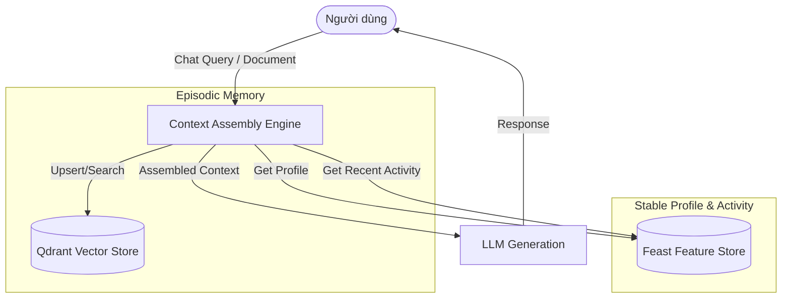

# Bonus Challenge — Hybrid Memory AI Agent Architecture

This document describes the architectural design and decisions for a minimal Personal AI Assistant with Hybrid Memory, targeting a Vietnamese context.

## 1. Kiến Trúc Tổng Quan (Architecture Overview)

**Luồng dữ liệu:**
1. **Lưu trữ (Remember):** Khi user trò chuyện hoặc tải lên tài liệu, hệ thống chunk văn bản, embed và lưu vào Qdrant với payload chứa `user_id` và `timestamp`.
2. **Truy xuất (Recall):** Khi user hỏi, hệ thống:
   - Truy xuất `user_profile` (sở thích, tốc độ đọc) và `recent_activity` (tần suất truy vấn) từ Feast Feature Store.
   - Tìm kiếm vector trong Qdrant lọc theo `user_id` để lấy episodic memory.
   - Lắp ráp thành context prompt tổng hợp.
3. **Sinh phản hồi:** Gửi context và query tới LLM để tạo câu trả lời cá nhân hoá.

---

## 2. Các Quyết Định Kiến Trúc (Architecture Decisions)

### Quyết định 1: Chunking Strategy cho Episodic Memory
**Tradeoff: Semantic Break + Sliding Window vs Fixed Token Count**
- **X (Lựa chọn):** Semantic Break (cắt theo câu/đoạn) + Sliding Window overlap.
- **Y (Thay thế):** Cắt cứng theo số token (Fixed Token Count).
- **Tại sao chọn X:** Bộ nhớ episodic của con người mang tính ngữ nghĩa. Cắt cứng token có thể làm đứt đoạn một ý quan trọng, khiến vector bị mất ngữ cảnh (đặc biệt với tiếng Việt hay dùng từ ghép). Semantic break đảm bảo chất lượng retrieval cao hơn dù tốn chi phí storage và processing hơn một chút.

### Quyết định 2: Feature Schema & Khả năng lưu trữ
**Tradeoff: Tabular Features vs Embedding Feature View**
- **X (Lựa chọn):** Tabular Features kết hợp với list of strings (ví dụ `topic_affinity`).
- **Y (Thay thế):** Dùng Embedding Feature View (nén toàn bộ history thành 1 vector).
- **Tại sao chọn X:** Với một POC và hệ thống early-stage, Tabular/List features dễ debug, dễ giải thích (explainable) và có thể trực tiếp truyền vào prompt của LLM dưới dạng văn bản thuần ("Bạn thích đọc về Cloud và AI"). Nếu dùng embedding feature, ta cần cơ chế LLM đọc được vector trực tiếp (soft-prompting) hoặc dùng nó cho mô hình Recommendation riêng biệt, làm tăng độ phức tạp không cần thiết ở hiện tại.

### Quyết định 3: Freshness Strategy
**Tradeoff: Micro-batch (5 phút) vs Sub-second Streaming Push**
- **X (Lựa chọn):** Micro-batch 5 phút cập nhật Feature Store, nhưng Episodic (Vector) thì cập nhật Sub-second.
- **Y (Thay thế):** Đẩy streaming sub-second cho toàn bộ hệ thống.
- **Tại sao chọn X:** Việc user muốn AI "nhớ" ngay câu vừa nói là kỳ vọng cơ bản (Episodic memory cần sub-second). Tuy nhiên, hồ sơ ổn định (Stable Profile) như `topic_affinity` hay `reading_speed` không thay đổi từng giây. Việc dùng micro-batch cho Feature Store giảm tải hệ thống đáng kể mà không ảnh hưởng tới trải nghiệm người dùng.

---

## 3. Cân Nhắc Ngữ Cảnh Đặc Thù Việt Nam (Vietnamese-Context)
- **Xử lý Code-Switching:** Người dùng Việt Nam trong ngành công nghệ thường xuyên mix tiếng Việt và tiếng Anh (vd: "Tạo cluster Kubernetes trên đám mây"). Hệ thống sử dụng mô hình embedding đa ngữ (như `bge-m3` hoặc ít nhất là các model support text lai) và bộ tokenizer phù hợp để không bị out-of-vocabulary.
- **Bảo mật Dữ liệu & Nghị định 13 (Decree 13/2023/NĐ-CP):** Dữ liệu cá nhân (kể cả sở thích hay lịch sử chat) là dữ liệu nhạy cảm. Hệ thống thiết kế tách biệt dữ liệu theo `user_id` ngay từ schema của Qdrant (dùng Payload filter) và Feast để dễ dàng xoá (Right to be Forgotten) theo yêu cầu của Nghị định.

---

## 4. Các Giới Hạn Hiện Tại (Limitations)
- **Multi-user Privacy Isolation:** POC mới dùng payload filter (`user_id`) để tách dữ liệu trong cùng một Qdrant collection. Trên thực tế nên chia collection hoặc dùng multi-tenancy auth mạnh hơn.
- **Forgetting / Memory Decay:** Chưa có cơ chế quên (TTL cho vector hoặc archival strategy) cho những đoạn hội thoại quá cũ.
